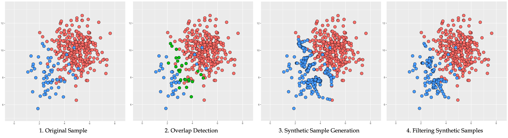
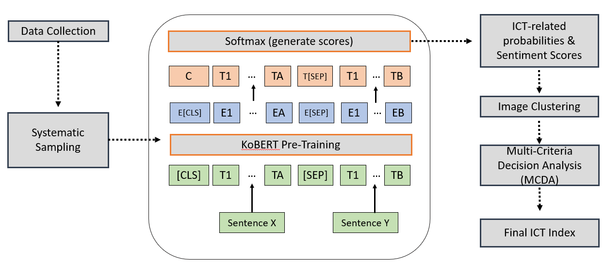
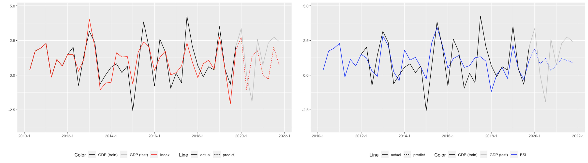

## Working Papers

1. D.E. Min, H.H. Lee, and J.H. Im: Filtered Synthetic sample Generation in Overlapping Areas - A Resampling Approach for Imbalanced Classification

Abstract: Imbalanced classification refers to the classification of data where one class consists of a smaller number of samples than the other class. In this paper, we introduce a new resampling method for binary imbalanced classification. Our method constructs a balanced set by generating synthetic samples within the k-nearest neighbors of the overlapping minority samples, and resampling the generated synthetic minority samples with sampling weights constructed with a calibration constraint given based on the original minority sample mean. Through this process, we generate additional samples in the tricky borderline area, while also removing noisy samples far from the original minority sample mean. Through several experiments, we show that our method outperforms other oversampling methods.

&NewLine;
&NewLine;

2. D.E. Min, N. Kang, Y.H. Cho, J.Y. Choi, and J.H. Im: Deep-learning Approach for Economic Index Construction in the ICT Industry - A Case Study for Korea

Abstract: The ICT industry refers to the industry of “information and communications technology”. In South Korea, the ICT industry plays an important role in the economy, possessing 12.8% of the GDP of South Korea. Due to recent unforeseen incidents, it has become a challenge to accurately predict the trend of the ICT industry. This study aims to generate an economic index through a deep learning approach that integrates Natural Language Processing (NLP) models and image clustering techniques. We introduce a 4-step protocol to generate an economic index to evaluate economic performance. First, systematic sampling was applied to produce a balanced sample of ICT industry news for each period. Second, feature engineering techniques developed by KoBERT were applied to generate two types of scores for each sentence - relevance scores and sentiment scores. Third, textual data were transformed into joint plot images for visualization and then grouped into different clusters based on news categories. In the end, Multi-criteria Decision Analysis (MCDA) is applied to generate the final economic index.
